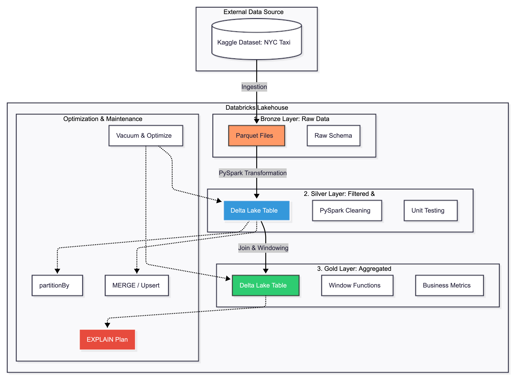
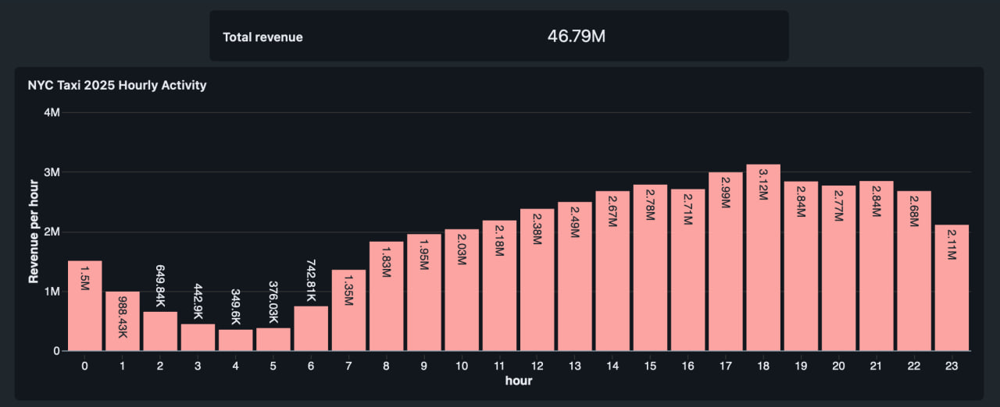
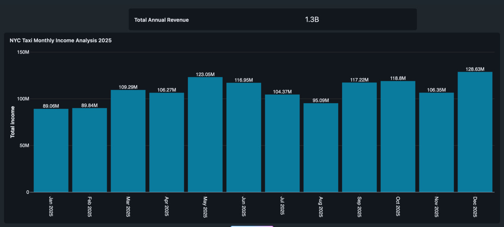
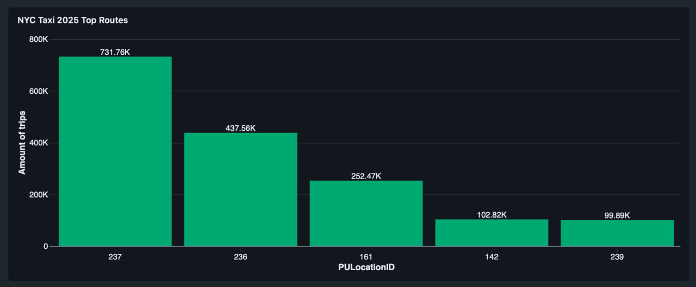

# NYC Taxi Data Pipeline: End-to-End Lakehouse Project

## 📌 Project Overview
This project demonstrates a complete ETL/ELT pipeline processing the **NYC Yellow Taxi Dataset (2025)** using **PySpark** on the **Databricks** cloud platform. 

The primary goal was to build a scalable **Medallion (Lakehouse) Architecture** capable of handling over 48 million records—an volume of data that exceeds the capacity of standard SQL tools on local machines.

## 🏗 Architecture: Medallion Pattern
The pipeline follows the industry-standard Lakehouse architecture:
* **Bronze (Raw Layer):** Initial ingestion of raw data from CSV to **Delta/Parquet** format.
* **Silver (Cleaned & Optimized):** Data cleansing (filtering dates, handling nulls/outliers) and schema enforcement. **Partitioning** by month is implemented here for storage optimization.
* **Gold (Business Layer):** Final business-level aggregations. Utilizes **Window Functions** for advanced analytics like cumulative revenue tracking.

## 🛠 Tech Stack
* **Language:** Python (PySpark)
* **Engine:** Apache Spark 3.x
* **Platform:** Databricks Community Edition
* **Storage:** Delta Lake (supporting ACID transactions, Time Travel, and Schema Evolution)
* **Optimization Tools:** Z-Order Clustering, Partitioning, Vacuum, and Optimize

## 🚀 Key Engineering Solutions

### 1. Data Partitioning & Optimization
To avoid the "Small File Problem" and improve query performance, the Silver layer is partitioned by `pickup_month`. This allows Spark to skip irrelevant data during downstream processing.

### 2. Advanced Analytics (Window Functions)
Implemented **Window Specifications** to calculate a running total of revenue. This allows for real-time tracking of financial goals directly in the data layer.

### 3. Data Quality & Cleaning
* Filtered out records outside the **2025** timeframe.
* Removed trips with zero or negative distances/amounts.
* Handled inconsistent `payment_type` and `RatecodeID` values by replacing anomalies with `NULL`.
* Calculated `trip_duration_minutes` to identify and remove unrealistic trip records.

### 4. Maintenance (Middle-Level Features)
Implemented **Delta Lake** maintenance commands to ensure high performance:
* `OPTIMIZE`: Compacting small files into larger ones.
* `VACUUM`: Removing old data files to save storage and maintain privacy.
* `.explain()`: Analyzing Spark execution plans to identify bottlenecks.

## Data Architecture
The data architecture diagram for this project :

## 📊 Visualizations & Insights
The project concludes with a high-level dashboard featuring:
* **Daily vs. Cumulative Revenue:** A dual-axis chart showing daily performance against a $1.3B+ yearly goal.
* **Hourly Activity:** Identification of peak hours and average fare fluctuations.
* **Top 10 Routes:** Most frequent pickup/dropoff combinations for fleet optimization.

### 📊 Dashboards

## 📂 How to Run
1.  **Register:** Create a [Databricks Community Edition](https://community.cloud.databricks.com/) account.
2.  **Upload Data:** Place the NYC Taxi CSV files into DBFS (Databricks File System).
3.  **Import Notebooks:** Clone this repository and upload the notebooks to your Databricks workspace.
4.  **Execute Pipeline:** Run the notebooks in sequence (Bronze → Silver → Gold).

## License
This project is licensed under the MIT License. You are free to use, modify, and share this project with proper attribution.

## About me 
Hey, my name is Anastasiia, I am a Data Engineer wanting to achieve high results.
 
I'm open to feedback and would love to discuss the architectural choices I made in this project!  
